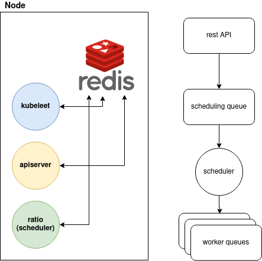

# kubeleet
Container orchestration agent on worker nodes

## Architecture


## Workflow

Service creation is initiated by /service endpoint. Which in turn breaks down the service into pods (containers) based on number of replicas. Then pod creation events are pushed into scheduler queue.

Scheduler picks up the events and distributes them based on a score (currently no. of pods and kernel memory/cpu/io psi metrics) to worker nodes. Workers set their current timestamp on a redis key every 5 seconds, so before distributing pods to a node, the scheduler will put the node aside if the timestamp is more than 20 seconds old. This scan is also done periodically and on node down, all the pods will be pushed again (from worker node container-set) to scheduler queue to be rebalanced to other nodes.

As all redis commands are atomic, api-server and scheduler can be run on all nodes and all communication is handled within redis, so there's no chance of race conditions or double handling of an event. In steps which data loss was possible, redis "Reliable Queue" pattern is used. Redis nodes are HA single master with sentinel, so all will be communicating with a single master (mostly protected from lagging replicas in a master-loss scenario by min-slaves-to-write directive, however that risk is not eliminated completely and is the only risk in this scope)

### Sample Pod Description
```
"{\"name\":\"test\",\"uuid\":\"djkfghsdjkfhjksdghfjksdjkfhsd\",\"image\":\"spaster/alpine-sleep\",\"replica\":3}"
```

You can test kubeleet by pushing into workers pending queue, like this:

```
$ redis-cli
LPUSH pq:worker1 "{\"name\":\"test\",\"uuid\":\"djkfghsdjkfhjksdghfjksdjkfhsd\",\"image\":\"spaster/alpine-sleep\",\"replica\":3}"
```

